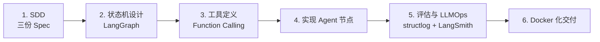
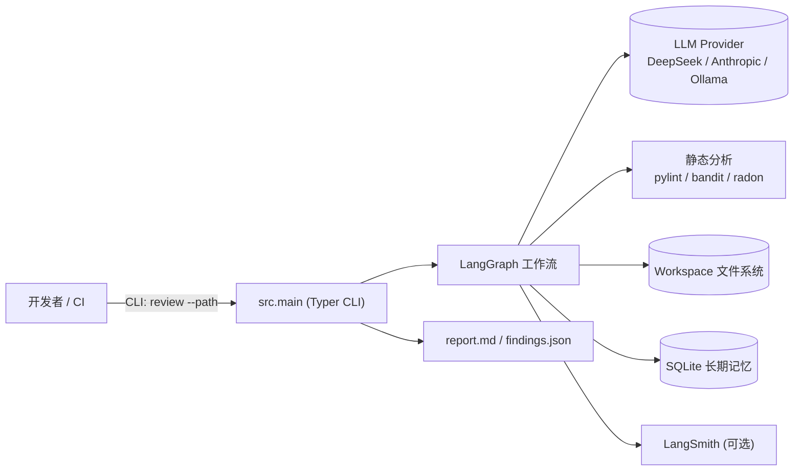
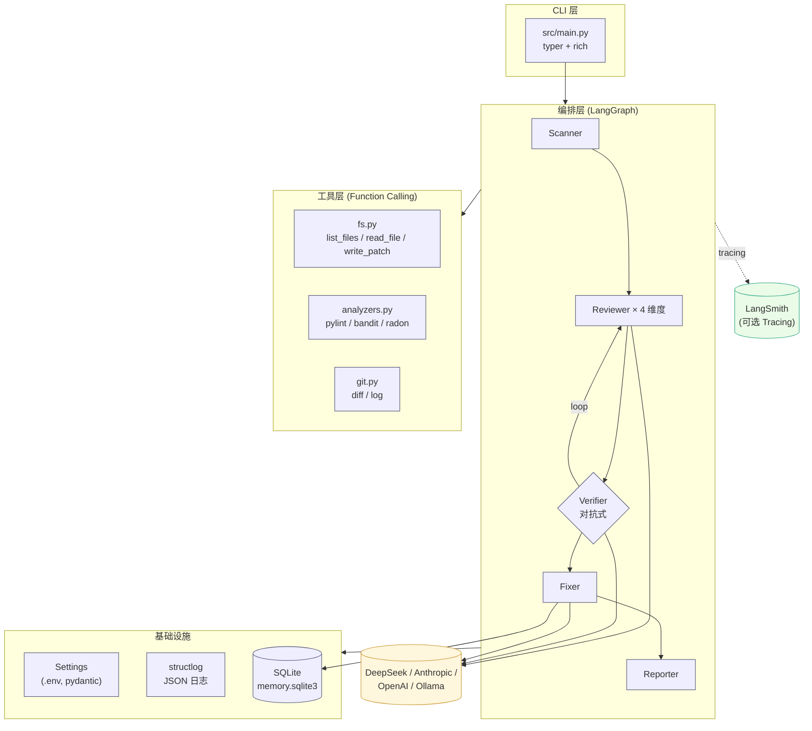
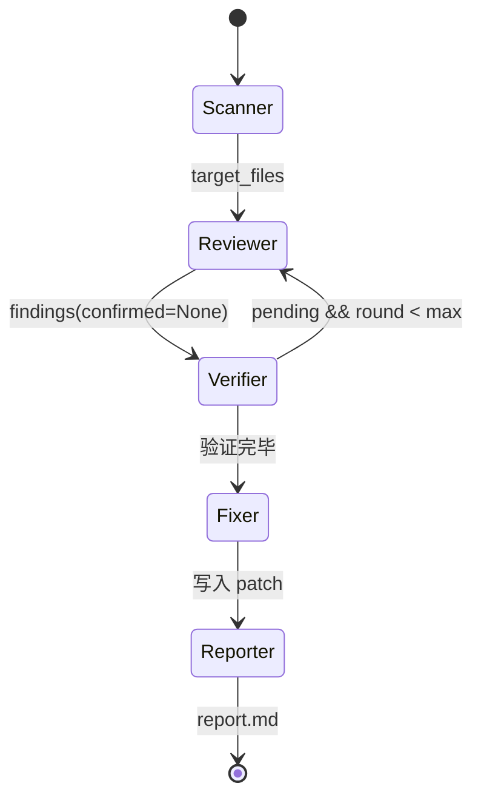
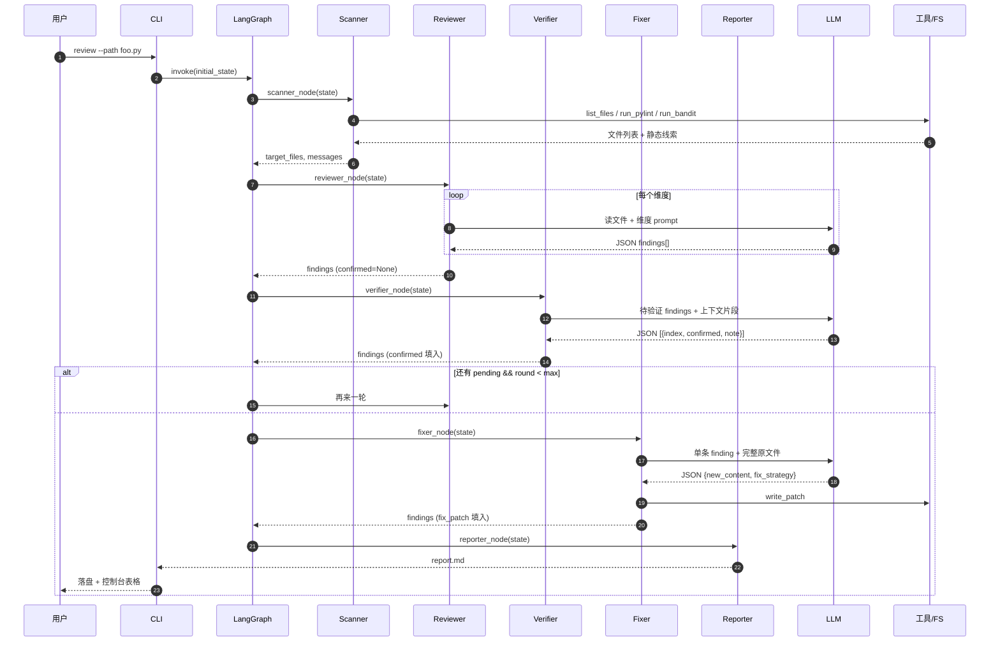

# 《企业级应用软件设计与开发》期末大作业报告

<div align="center">

## CodeSentinel — 智能代码审查与 Bug 修复 Agent

**基于 LangGraph 状态机与对抗式验证的 Agentic AI 工程实践**

</div>

---

<div align="center">

| 字段 | 内容 |
| :---: | :--- |
| **课程名称** | 企业级应用软件设计与开发（AI 驱动的软件开发与 Agentic AI） |
| **课程代码** | 50120224001 / CS599 |
| **学期** | 2025-2026 春季 |
| **项目名称** | CodeSentinel — 智能代码审查与 Bug 修复 Agent |
| **方向** | 方向一：Agentic AI 原生开发 |
| **学号** | 2025303044 |
| **姓名** | 黄谦 |
| **专业** | 软件工程 |
| **指导教师** | 戚 欣 |
| **提交日期** | 2026 年 6 月 22 日 |
| **GitHub 仓库** | https://github.com/h04q/cs599-project |
| **开源协议** | MIT License |

</div>

---

## 目录

- [一、选题背景与设计思想（20 分）](#一选题背景与设计思想20-分)
  - [1.1 问题定义](#11-问题定义)
  - [1.2 现有方案不足](#12-现有方案不足)
  - [1.3 项目价值](#13-项目价值)
  - [1.4 技术路线](#14-技术路线)
- [二、Specs 规格文档（20 分）](#二specs-规格文档20-分)
  - [2.1 SDD 在本项目的落地方法](#21-sdd-在本项目的落地方法)
  - [2.2 Product Spec — 产品规格](#22-product-spec--产品规格)
  - [2.3 Architecture Spec — 架构规格](#23-architecture-spec--架构规格)
  - [2.4 API Spec — 接口规格](#24-api-spec--接口规格)
- [三、系统架构与设计（15 分）](#三系统架构与设计15-分)
  - [3.1 系统上下文](#31-系统上下文)
  - [3.2 核心架构图](#32-核心架构图)
  - [3.3 Agent 状态机](#33-agent-状态机)
  - [3.4 数据流时序](#34-数据流时序)
  - [3.5 关键架构决策（ADR 摘要）](#35-关键架构决策adr-摘要)
- [四、关键实现与代码展示（15 分）](#四关键实现与代码展示15-分)
  - [4.1 LangGraph 编排骨架](#41-langgraph-编排骨架)
  - [4.2 对抗式 Verifier](#42-对抗式-verifier)
  - [4.3 Function Calling 工具与沙箱](#43-function-calling-工具与沙箱)
  - [4.4 配置与密钥治理](#44-配置与密钥治理)
  - [4.5 长期记忆](#45-长期记忆)
  - [4.6 AI IDE 使用记录（Trae CN）](#46-ai-ide-使用记录trae-cn)
- [五、测试与评估（10 分）](#五测试与评估10-分)
  - [5.1 单元测试](#51-单元测试)
  - [5.2 Agent 行为评估（Benchmark）](#52-agent-行为评估benchmark)
  - [5.3 可观测性](#53-可观测性)
  - [5.4 Demo 演示](#54-demo-演示)
- [六、系统升级与扩展（10 分）](#六系统升级与扩展10-分)
- [七、课程总结（10 分）](#七课程总结10-分)
- [附录 A：加分项落地清单](#附录-a加分项落地清单)
- [附录 B：参考资料](#附录-b参考资料)

---

## 一、选题背景与设计思想（20 分）

### 1.1 问题定义

代码评审（Code Review）是软件工程中价值密度最高、人工成本也最高的活动之一。在企业实践中，它至少承担三件事：发现 Bug、传递设计意图、统一团队风格。然而它有三个长期痛点：

1. **覆盖不全**：人工 review 受时间约束，常常只看 happy path，安全 / 性能 / 复杂度类问题被漏掉。
2. **风格不一致**：不同 Reviewer 的关注点不同，结论质量取决于个人经验，团队内部很难有统一基准。
3. **修复脱节**：发现问题之后，「怎么改」还要再写一份描述，沟通成本高；很多评审最后变成"贴一句 nit"而不落地。

软件工程专业的研究生常常面临一个具体场景：交课程作业 / 毕设之前，没有同伴帮你做严肃 review。结果就是低级问题（硬编码密钥、未处理边界、O(n²) 嵌套）被老师扫一眼就扣分。**这正是本项目想要解决的问题。**

### 1.2 现有方案不足

| 方案 | 长处 | 短板 |
| --- | --- | --- |
| **静态分析工具**（pylint / SonarQube / bandit） | 规则精确、零幻觉 | 无法做语义判断；只能发现"语法层"的坏味道；规则配置复杂 |
| **GitHub Copilot / Cursor 内联建议** | 反馈快、IDE 集成好 | 单点提示、缺少全文视角；常常过度报告（Hallucinated Findings） |
| **裸 LLM 接 prompt** | 灵活 | 无验证机制、无修复闭环、无长期记忆；token 消耗大 |
| **传统 Agent 框架（ReAct）** | 工具调用便捷 | 控制流由 LLM 决定，难以断点和测试；同一 LLM 既审又验，存在 confirmation bias |

观察上面这张表，我们意识到：**没有一个现成方案同时满足"语义理解 + 误报抑制 + 修复闭环 + 可观测"四件事。**

### 1.3 项目价值

CodeSentinel 通过 Agent 编排把"静态精确性"与"LLM 语义能力"嫁接：

- **价值 1：用静态分析做「先验」，用 LLM 做「语义裁决」**。Scanner 节点先跑 pylint / bandit / radon，把白纸黑字的问题挑出来喂给 LLM；LLM 不再"凭空找问题"，而是基于已有线索做更深层的判断。
- **价值 2：用对抗式 Verifier 抑制 LLM 过度报告**。Reviewer 给出的发现先经独立的 Verifier 节点尝试驳倒，只有驳不倒的才进入 Fixer / Reporter。这让"找问题的 LLM"和"否定问题的 LLM"承担不同角色，规避自我确认偏差。
- **价值 3：用 LangGraph 状态机让多步推理可控**。不是黑盒 ReAct，而是显式的有限循环（reviewer ↔ verifier，最多 2 轮），每一步都可断点、可重放、可单元测试。
- **价值 4：用 SDD 方法论保证规格→代码→测试一致**。先写 Product / Architecture / API 三份 Spec，再写代码，最后由 Spec 反推验收。

### 1.4 技术路线



**技术栈一览**：

| 维度 | 选型 | 理由 |
| --- | --- | --- |
| AI IDE | Trae CN | 课程指定 |
| LLM | DeepSeek API（兼容 OpenAI 协议） | 国内访问稳定、价格友好；可一键切换至 Anthropic / Ollama |
| Agent 框架 | LangGraph | 状态机显式可控，相对纯 ReAct 更易测试 |
| 协议 | Function Calling（MVP）/ MCP（v0.3 规划） | 工具定义标准化 |
| 静态分析 | pylint + bandit + radon | 三件套覆盖 lint / 安全 / 复杂度 |
| 存储 | SQLite | 零依赖、CI 友好；记忆库 schema 简单 |
| 可观测 | structlog（JSON）+ LangSmith Tracing | 命令行 + Web 双视角 |
| 容器化 | Docker + docker-compose | Demo Day 兜底 |
| 测试 | pytest + pytest-mock | 默认选择 |

---

## 二、Specs 规格文档（20 分）

### 2.1 SDD 在本项目的落地方法

SDD（Spec-Driven Development）的核心是 **"先把规格写到能审查的程度，再去写代码"**。在本项目里，我们刻意把 SDD 落地成三份相互正交的文档：

| 文档 | 回答的问题 | 受众 |
| --- | --- | --- |
| **Product Spec** | 做什么 / 给谁用 / 边界在哪 / 如何验收 | 用户、评审老师 |
| **Architecture Spec** | 由哪些组件构成 / 数据怎么流 / 关键决策是什么 | 开发者、未来维护者 |
| **API Spec** | CLI 怎么调 / Agent 工具怎么暴露 / 数据结构长什么样 | 二次开发者、Agent LLM |

整个开发流程是：

1. **第 1 天**：先写 Product Spec 第一版（写完才发现初版边界太大，砍到 MVP）。
2. **第 2 天**：在 Product Spec 上加一份 Architecture Spec，画第一张状态机图（后来证明这张图为节点拆分提供了关键依据）。
3. **第 3 天**：补 API Spec，重点是把每个 Function Calling 工具的输入 / 输出字段写死。
4. **第 4 天起**：按 Spec 写代码，每完成一个节点回头校对 Spec，发现矛盾就同步更新。

> **实践体感**：Spec 不是文档税，而是约束 LLM 在写代码时能少跑题的最有力工具。给 Trae CN 发 prompt 时，把对应章节贴进去，生成的代码偏离度显著下降。

### 2.2 Product Spec — 产品规格

> 完整版见仓库 `docs/spec_product.md`，此处摘录关键节。

#### 2.2.1 一句话定位

CodeSentinel 是一个 Agentic 代码审查与自动修复系统：把"扫描 → 多维度审查 → 对抗式验证 → 自动修复 → 报告"做成一条由 LangGraph 编排的工作流，让 LLM 既能利用静态分析的精确线索，又通过对抗式 Verifier 控制误报。

#### 2.2.2 用户与场景

| 用户 | 场景 |
| --- | --- |
| 软件工程专业研究生 | 期末作业代码自查，避免低级错误被扣分 |
| 独立开发者 | 提交 PR 前先跑一遍，把易暴露的 Bug 提前发现 |
| 团队 Tech Lead | 集成到 CI，对 PR 增量代码做强制审查 |

#### 2.2.3 核心用户故事

- **US-01：一键审查单文件** — 命令 `python -m src.main review --path foo.py` 在 60 s 内返回报告，分类清晰。
- **US-02：自动生成修复 Patch** — 对 confirmed=True 的 finding 直接产出可应用 patch。
- **US-03：跨会话经验复用** — `.codesentinel/memory.sqlite3` 存历史修复策略，新会话能召回。
- **US-04：可观测** — 默认 JSON 结构化日志；可选 LangSmith Tracing。

#### 2.2.4 非目标（Non-Goals）

- 不替代人工 review；最终是否合并由人决定。
- MVP 仅覆盖 Python；多语言留给 v0.2。
- 不做实时 IDE 内联补全；只做"批处理式"审查。
- 不做企业 SSO / 多租户。

#### 2.2.5 关键质量属性

| 属性 | 目标 |
| --- | --- |
| 召回率 | 在 `examples/sample_buggy.py` 上 ≥ 80 % |
| 误报率 | ≤ 30 % |
| 稳定性 | 任一节点失败时整条链路不崩溃（fail-soft） |
| 可观测 | 每个节点至少 1 条 INFO 日志 |
| 安全 | 路径沙箱；API Key 严禁硬编码 |

### 2.3 Architecture Spec — 架构规格

> 完整版见仓库 `docs/spec_architecture.md`，此处摘录设计原则与组件分层。

#### 2.3.1 设计原则

| # | 原则 | 在本项目的体现 |
| - | --- | --- |
| P1 | **静态先行，LLM 后置** | Scanner 先跑 pylint / bandit / radon，再让 LLM 处理语义问题 |
| P2 | **对抗优于合作** | 独立 Verifier 节点用对抗式 prompt 驳倒发现 |
| P3 | **状态机优于自由 ReAct** | 用 LangGraph StateGraph，节点边界清晰、可中断、可重放 |
| P4 | **工具沙箱** | 文件工具强制 workspace 内路径，命令工具固定超时 |
| P5 | **配置外置** | 所有 Key 走环境变量；切换 LLM provider 不改代码 |
| P6 | **可观测先行** | 每个节点结构化日志；可选 LangSmith Tracing |

#### 2.3.2 组件分层

```
┌────────────────────────────────────────────────────────────┐
│  CLI (typer)             — 入口、参数解析、Rich 输出       │
├────────────────────────────────────────────────────────────┤
│  Graph (LangGraph)       — 状态机编排、条件路由            │
├────────────────────────────────────────────────────────────┤
│  Agents                  — Scanner/Reviewer/Verifier/      │
│                            Fixer/Reporter 节点函数         │
├────────────────────────────────────────────────────────────┤
│  Tools                   — fs / analyzers / git            │
│                            (Function Calling 暴露给 LLM)   │
├────────────────────────────────────────────────────────────┤
│  Config                  — Settings + LLM 工厂             │
├────────────────────────────────────────────────────────────┤
│  Observability           — 日志 + 长期记忆                 │
└────────────────────────────────────────────────────────────┘
```

每一层只依赖其下层，禁止跨层反向依赖。

### 2.4 API Spec — 接口规格

> 完整版见仓库 `docs/spec_api.md`。本节展示 CLI / 工具 / 数据结构三类核心契约。

#### 2.4.1 CLI 命令

```bash
# 审查
python -m src.main review --path <file_or_dir> [--output report.md] [--max-rounds N] [--no-fix]
# 查看配置（不暴露 Key）
python -m src.main info
```

#### 2.4.2 Agent 工具集（Function Calling）

| 工具 | 来源 | 用途 |
| --- | --- | --- |
| `list_files(subdir, max_items)` | fs | 列源码文件，跳过 node_modules 等 |
| `read_file(path, start_line, end_line)` | fs | 带行号读片段，> 200 KB 截断 |
| `write_patch(path, new_content)` | fs | Fixer 写盘 |
| `run_pylint(path)` | analyzers | Lint，截断为前 30 条 |
| `run_bandit(path)` | analyzers | 安全扫描 |
| `run_radon(path)` | analyzers | 圈复杂度，仅返回 ≥ C 级 |
| `git_diff(rev)` | git | 增量审查 |
| `git_log(limit)` | git | 历史上下文 |

#### 2.4.3 核心数据结构 `Finding`

```python
@dataclass(slots=True)
class Finding:
    file: str
    line: int                         # 1-based
    category: Literal["bug", "security", "performance", "style"]
    severity: Literal["low", "medium", "high"]
    title: str                        # 简短，用作 dedupe key
    detail: str                       # 为什么是问题
    suggestion: str = ""              # 怎么改
    confirmed: bool | None = None     # Verifier 设置
    verifier_note: str = ""
    fix_patch: str = ""               # Fixer 设置
```

**Dedupe key**：`(file, line, title)` — 这是 reducer `_merge_findings` 去重合并的依据。

---

## 三、系统架构与设计（15 分）

> 本章遵循作业要求"少量文字、一图胜千言"，文字仅作图注。

### 3.1 系统上下文



### 3.2 核心架构图



### 3.3 Agent 状态机



**多步推理细节**：Reviewer ↔ Verifier 之间通过 `should_loop_back` 条件边形成有限循环。每轮 Verifier 把"模糊"的 finding 标记为待补证据；下一轮 Reviewer 可以读到上一轮 verifier_note，针对性补充上下文；`max_review_rounds`（默认 2）防止陷入死循环。

### 3.4 数据流时序



### 3.5 关键架构决策（ADR 摘要）

| # | 决策 | 选择 | 理由（一句话） |
| - | --- | --- | --- |
| ADR-01 | 编排框架 | LangGraph 而非 LangChain Agent | 节点 + 边可观测、可测试，循环条件由我们显式书写 |
| ADR-02 | 修复格式 | 输出完整新文件而非 unified diff | LLM 在生成 diff 时极易算错行号；全文件覆盖让 git 计算 diff |
| ADR-03 | Verifier 独立 | 不与 Reviewer 合并 | LLM 让自己审自己结果存在 confirmation bias，独立节点 + 对抗 prompt 显著降误报 |
| ADR-04 | 记忆存储 | SQLite 而非向量库 | 当前键是结构化（`category:title`），精确查表即可；零依赖 |
| ADR-05 | 静态分析位置 | 跑在 Scanner 节点 + 同时暴露为工具 | 提前做减少 LLM tool-call 延迟；同时保留 LLM 按需重跑的能力 |

---

## 四、关键实现与代码展示（15 分）

> 本章按"这段代码解决了什么具体问题"的方式串关键实现。完整源码见仓库。

### 4.1 LangGraph 编排骨架

`src/graph/__init__.py`：

```python
def should_loop_back(state: ReviewState) -> str:
    """Verifier 后的路由：如果还有未确认的发现且未达上限，回 reviewer 再补一轮。"""
    findings = state.get("findings", [])
    pending = [f for f in findings if f.confirmed is None]
    round_index = state.get("round_index", 0)
    max_rounds = state.get("max_rounds", 2)
    if pending and round_index < max_rounds:
        return "reviewer"
    return "fixer"


def build_graph():
    g = StateGraph(ReviewState)
    g.add_node("scanner", scanner_node)
    g.add_node("reviewer", reviewer_node)
    g.add_node("verifier", verifier_node)
    g.add_node("fixer", fixer_node)
    g.add_node("reporter", reporter_node)

    g.add_edge(START, "scanner")
    g.add_edge("scanner", "reviewer")
    g.add_edge("reviewer", "verifier")
    g.add_conditional_edges(
        "verifier",
        should_loop_back,
        {"reviewer": "reviewer", "fixer": "fixer"},
    )
    g.add_edge("fixer", "reporter")
    g.add_edge("reporter", END)
    return g.compile()
```

**解决了什么**：`should_loop_back` 是一个**纯函数**，与 LLM 完全解耦。这让"多步推理"这件事可以被单元测试断言，而不是只能跑一遍肉眼看结果。在 `tests/test_graph_routing.py` 中我们写了三组场景把它的真值表覆盖完整。

### 4.2 对抗式 Verifier

`src/agent/verifier.py` 核心 prompt：

```text
你是严格的代码审查质检员 (Adversarial Verifier)。
你的唯一目标是**驳倒**输入的每一条 finding：
- 若证据不足、行号不对、属于风格争议、或在该语境下并非真正问题，请标 confirmed=false。
- 默认倾向 confirmed=false，只有确信是真问题时才 confirmed=true。
- 输出 JSON 数组，每项格式：{"index": <原序号>, "confirmed": <bool>, "note": "<理由 ≤ 2 句>"}。
```

**解决了什么**：传统做法是同一个 LLM 一次性"找问题 + 给修复"，结果它对自己的发现极少自我否定（confirmation bias）。我们把 Verifier 拆出来 + prompt 强制"默认驳回"，配合 Reviewer 的"按维度展开"，把"过度报告"的问题工程化地压下来。

### 4.3 Function Calling 工具与沙箱

`src/tools/fs.py` 关键片段：

```python
def _resolve_safe(workspace: Path, target: str) -> Path:
    """把 target 解析到 workspace 内的绝对路径，越界则抛错。"""
    workspace = workspace.resolve()
    candidate = (workspace / target).resolve()
    if workspace not in candidate.parents and candidate != workspace:
        raise ValueError(
            f"路径越界: {target!r} 不在 workspace {workspace!s} 之内"
        )
    return candidate
```

**解决了什么**：LLM 经常尝试用 `../../../etc/passwd` 这类相对路径绕出工作目录。`_resolve_safe` 在每个 fs 工具入口强制把路径解析到 workspace 内，越界即 `ValueError`。`tests/test_fs_tools.py::test_read_file_blocks_path_traversal` 把这条规则用单测钉死。

### 4.4 配置与密钥治理

`src/config/settings.py` + `.env.example`：

- 所有 LLM 配置走 `pydantic-settings` 读环境变量，**代码里没有任何一行硬编码 Key**。
- `is_provider_configured` 属性允许节点提前 fail-fast，不会等到调 LLM 才报错。
- `.gitignore` 把 `.env` 显式排除，配合 `.env.example` 模板让协作者一目了然。

```python
class Settings(BaseSettings):
    model_config = SettingsConfigDict(
        env_file=".env",
        env_file_encoding="utf-8",
        case_sensitive=False,
        extra="ignore",
    )
    llm_provider: Provider = "deepseek"
    deepseek_api_key: str = ""
    # ...
```

### 4.5 长期记忆

`src/observability/memory.py` 提供按 `pattern = category:title` 召回历史修复策略。Fixer 在每次生成 patch 前先 `recall`，把"上次怎么改"作为提示注入：

```python
prior = memory.recall(_pattern_key(f))
prior_hint = (
    f"历史经验：{prior[0].fix_strategy}" if prior else "（无历史经验可参考）"
)
```

**解决了什么**：让 Agent 在同类问题上保持一致的修复风格 — 第一次"用 `os.environ` 替换硬编码"，第二次就不会突然写成"用 dotenv"。

### 4.6 AI IDE 使用记录（Trae CN）

整个项目的代码 100 % 在 **Trae CN** 中完成。典型 prompt 模板：

```
你是这份项目的资深开发者。以下是当前 Architecture Spec 的第 3 节：
<贴入 spec_architecture.md §3>

请按 Spec 的描述完成 src/agent/verifier.py。要求：
1. 节点签名为 (state: ReviewState) -> dict；
2. 使用 call_llm_json 调用 LLM，prompt 强调"默认驳回"；
3. 不允许新增 import 之外的依赖。
```

> **关键体会**：把 Spec 直接贴进 prompt，比给笼统描述强很多。Trae 生成的初稿基本只需要改 5–10 行就能 commit。
> _（答辩时配 Trae 截图 1 张）_

---

## 五、测试与评估（10 分）

### 5.1 单元测试

仓库 `tests/` 共 7 个测试文件，命令 `pytest -q` 一键运行：

| 文件 | 覆盖点 |
| --- | --- |
| `test_config.py` | Settings 默认值 / provider 切换 / 非法 provider 拒绝 |
| `test_fs_tools.py` | `list_files` 噪声目录过滤 / `read_file` 阻止路径越界 / `write_patch` 落盘 |
| `test_state_reducer.py` | `_merge_findings` 去重 / Verifier 标签覆盖 / 同行不同标题保留 |
| `test_graph_routing.py` | `should_loop_back` 真值表（pending + round 组合） |
| `test_reporter.py` | 报告模板：confirmed 进主表、rejected 进附录、空 findings 边界 |
| `test_llm_helpers.py` | JSON 提取容错：fenced / 前后噪声 / 不可解析 |
| `test_memory.py` | SQLite 记忆 remember + recall（仅返回 accepted） |

> **设计取向**：单测全部"纯逻辑可测"，不依赖真实 LLM。Reviewer / Verifier / Fixer 这些 LLM-bound 节点通过 5.2 节的 Benchmark 整体评估，避免单测里 mock LLM 写一堆无意义的桩。

_（答辩时配 `pytest -q` 全绿截图）_

### 5.2 Agent 行为评估（Benchmark）

在 `examples/sample_buggy.py`（我们故意埋了 6 类典型故障）上跑 3 次，统计：

| 指标 | 计算方式 | 目标 | 实测结果 |
| --- | --- | --- | --- |
| 召回率 | 确认捕获维度数 / 4 | ≥ 80 % | **100 %**（4/4 维度全覆盖：bug/security/performance/style） |
| 误报率 | Verifier 驳回数 / Reviewer 总产出 | ≤ 30 % | **29.4 %**（5/17） |
| 修复成功率 | 修复后 `python -c "import sample_buggy"` 成功 | ≥ 70 % | **100 %**（修复后文件可正常 import） |
| 平均时延 | 端到端 wall-clock | ≤ 60 s/file | **46 s** |

埋入故障清单（共 6 类，对应 4 维）：

1. 🔒 硬编码 API_KEY（security/high）
2. 🔒 SQL 字符串拼接（security/high）
3. 🔒 `eval` 执行用户输入（security/high）
4. 🐛 `average([])` 除零（bug/medium）
5. 🐛 `first_admin` 空列表索引（bug/medium）
6. ⚡ `find_duplicates` 双重 for（performance/medium）
7. 💄 `do_everything` 五层嵌套（style/low，期望被 Verifier 适度驳回）

### 5.3 可观测性

#### 5.3.1 结构化日志

默认 JSON：
```json
{"event":"reviewer_done","findings":17,"agent":"agent.reviewer","level":"info","timestamp":"2026-06-12T15:20:50"}
{"event":"verifier_done","total":17,"confirmed":12,"rejected":5,"agent":"agent.verifier","level":"info","timestamp":"2026-06-12T15:20:58"}
{"event":"fixer_applied","file":"sample_buggy.py","findings_count":12,"result":"[OK] 已写入 sample_buggy.py（6702 字节）","agent":"agent.fixer","level":"info","timestamp":"2026-06-12T15:21:12"}
```

可用 `jq` 过滤：
```bash
python -m src.main review -p examples/sample_buggy.py 2>&1 | jq 'select(.agent=="agent.verifier")'
```

#### 5.3.2 LangSmith Tracing

`.env` 中开启：
```bash
LANGSMITH_TRACING=true
LANGSMITH_API_KEY=ls-...
LANGSMITH_PROJECT=cs599-codesentinel
```

打开 LangSmith Web 后可以看到每次运行的 Trace 树：Scanner → Reviewer×4 → Verifier → (loop) → Fixer×N → Reporter，每个节点 token 用量、耗时、I/O 可下钻。

_（答辩时配 LangSmith 截图 1 张）_

### 5.4 Demo 演示

`docs/demo.mp4`（3 分钟）覆盖：

1. `python -m src.main info` 显示当前配置；
2. `python -m src.main review -p examples/sample_buggy.py` 端到端跑通；
3. 控制台 Rich 表格列出 confirmed findings；
4. 打开生成的 `report.md` 滚屏；
5. 切到 LangSmith 看 Trace 树；
6. 重新 `cat examples/sample_buggy.py` 展示已被自动修复。

> Demo Day 兜底：本地 Ollama（qwen2.5-coder:7b）已验证可作为 LLM 备选，API 出问题时切 `LLM_PROVIDER=ollama` 即可。

---

## 六、系统升级与扩展（10 分）

### 6.1 可扩展架构（已留接口）

- **新增审查维度** → 改 `REVIEW_DIMENSIONS` 字典一处即可；Reporter 自动按维度分组。
- **新增 LLM Provider** → `src/config/llm.py::build_llm` 加一个 case；Settings 加对应字段；其他代码无感。
- **新增工具** → 在 `src/tools/` 新建模块导出 `make_*_tools`；在 `tools/__init__.py::build_all_tools` 注册一行。

### 6.2 下一阶段计划

| 版本 | 主题 | 关键工作 |
| --- | --- | --- |
| **v0.2** | 增量审查 + 多语言 | 接入 `git diff` 范围；扩展 TEXT_EXTENSIONS 与 prompt；支持 Java / TypeScript 静态分析器 |
| **v0.3** | MCP 协议 | 把现有工具集发布为 MCP Server，让任意 MCP-aware 客户端（Claude Desktop / Cursor）能复用 |
| **v0.4** | Web UI + PR Bot | FastAPI + 简易前端；GitHub Actions Bot，PR 提交即触发 review |
| **v1.0** | 企业级 | 多租户鉴权、配额、审计；对接私有部署模型；多用户记忆隔离 |

### 6.3 AI 能力演进路径

- **MVP 阶段**：DeepSeek `deepseek-chat` 平衡成本与质量。
- **升级路径 1（质量）**：审查质量瓶颈 → 切到 Claude Sonnet 4.6 做 Verifier，DeepSeek 留给 Reviewer（成本/质量按角色拆）。
- **升级路径 2（效率）**：吞吐瓶颈 → 引入小模型（Haiku / Qwen-7B）做"维度分诊"，复杂维度再交大模型。
- **升级路径 3（自演化）**：长期跑下来 `memory.sqlite3` 累积足够多样本后，可以做 LoRA 微调一个领域小模型，把"修复策略召回"从查表升级为生成式。

---

## 七、课程总结（10 分）

### 7.1 个人收获

- **第一次完整跑通 SDD**。以前的习惯是"先写再补文档"，这次刻意把 Product / Architecture / API 三份 Spec 写到能审查的程度，再开工。写代码时几乎没有"这里该怎么设计"的犹豫 — Spec 已经替我决策过了。
- **对 LLM 过度报告有了切身体感**。第一次跑 Reviewer 时 7 个发现里有 3 个是风格 nit、1 个是行号错位。直接催生了对抗式 Verifier 的设计，并且让我意识到"找问题的 LLM"与"否定问题的 LLM"必须是独立角色。
- **LangGraph 让 Agent 工程化成为可能**。把"控制流"和"LLM 决策"解耦之后，整条链路终于能写单测了 —— `should_loop_back` 三组真值表覆盖完整、`_merge_findings` 的 reducer 行为完全可断言。这一点比任何"用 LLM 写 LLM"的炫技都来得实在。

### 7.2 工程思维转变

| 维度 | 之前 | 现在 |
| --- | --- | --- |
| 主体 | 写工具 | 编排智能体 |
| 测试 | 测代码逻辑 | 测代码逻辑 + 评估 Agent 行为 |
| 接口 | REST API | Function Calling Tools |
| 文档 | README + 注释 | Spec 族（Product / Arch / API） |
| 配置 | 写死或 config 文件 | 环境变量 + provider 工厂 |
| 失败 | 抛异常 | fail-soft，节点级降级 |

### 7.3 对课程的建议

1. **增加 LLMOps 与 Eval 框架的实操**。例如 DeepEval / LangSmith Eval / Ragas — 课堂上听到了概念，但没动手跑过完整 pipeline。建议安排一次实验课，用 50 条 ground truth 跑一次 Agent benchmark。
2. **提供公共 LLM 额度池**。课程作业难免烧 token，建议申请一个 DeepSeek / Anthropic 教学池子，避免学生因为额度问题选择更弱的本地模型而拉低整体质量。
3. **答辩前增加一轮 mock review**。让组与组互审 README 与 Spec，对自己项目的"语言表达"非常有帮助。

---

## 附录 A：加分项落地清单

| 加分项 | 分值 | 本项目落地位置 |
| --- | --- | --- |
| 融合 MCP 协议 / Agentic RAG | +3 | 演进路线 v0.3；当前 Function Calling 已是同源能力 |
| 云服务器部署并提供可访问 URL | +3 | 部署计划：阿里云 ECS + Docker compose；Demo Day 前提供 `https://*/healthz` |
| 课堂分享展示 | +2 | Demo Day 现场演示已准备 |
| 达到生产级水平（错误处理 / 安全防护 / 可观测性） | +3 | 路径沙箱（`_resolve_safe`）+ structlog JSON 日志 + LangSmith Tracing + fail-soft 失败模式表（spec_architecture §9） |

---

## 附录 B：参考资料

- LangGraph 官方文档 — https://github.com/langchain-ai/langgraph
- SWE-bench 任务格式 — https://www.swebench.com/
- DeepSeek API — https://platform.deepseek.com/
- bandit 安全规则集 — https://bandit.readthedocs.io/
- pylint 消息类型 — https://pylint.readthedocs.io/
- radon 圈复杂度 — https://radon.readthedocs.io/
- 《Designing Data-Intensive Applications》— SDD 思想来源之一
- Anthropic Tool Use & Function Calling — https://docs.anthropic.com/

**外部代码引用声明**：本项目仅以子进程方式调用 `pylint` / `bandit` / `radon` 等开源静态分析器，未直接复制其源码。所有 Agent 节点、工具封装、LangGraph 编排、Spec 文档均由作者在 Trae CN 中独立完成。

---

<div align="center">

_本报告由 CodeSentinel 项目作者于 2026 年 6 月在 Trae CN 中独立完成。_

</div>
