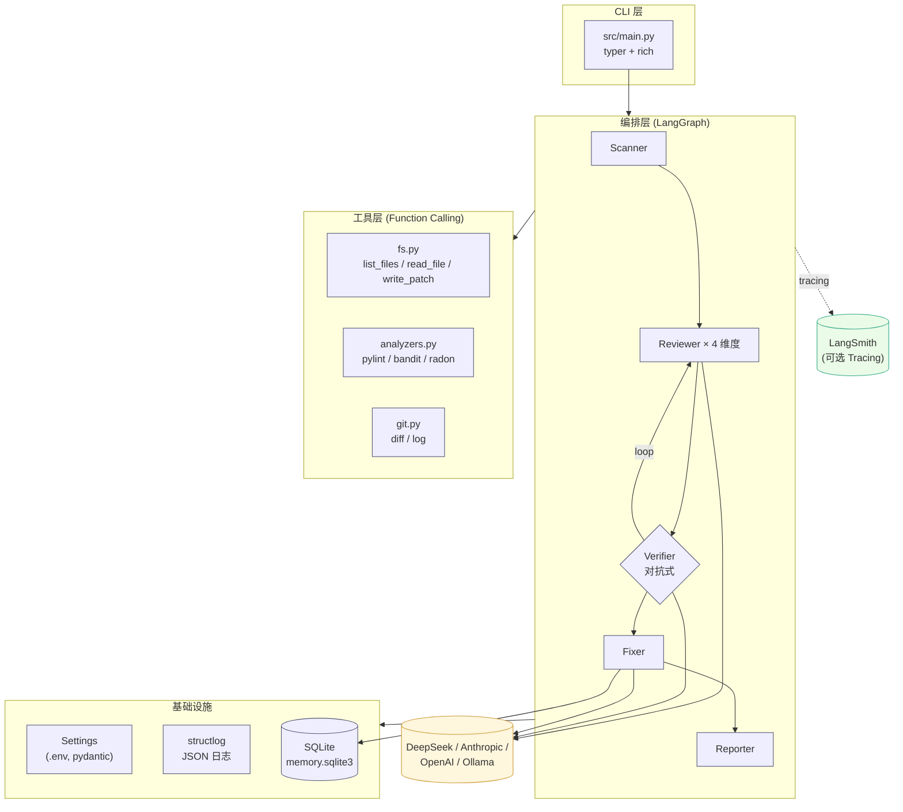
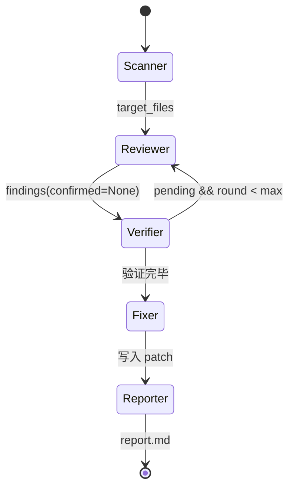
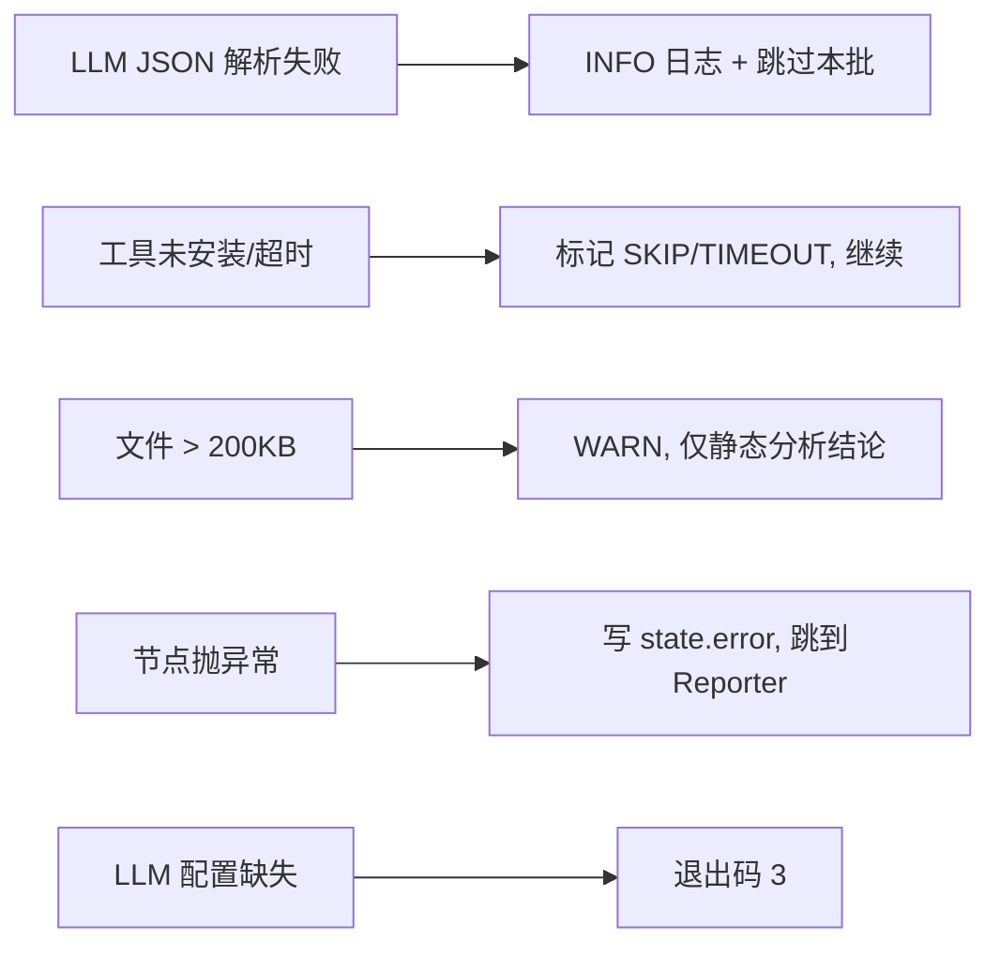

# Architecture — 详细架构说明（图文版）

> 这份文档是 **架构 Spec** 的图文化版本，用于答辩展示。要点是"少量文字、一图胜千言"。

## 1. 核心架构图

## 2. Agent 状态机（详细版）

## 3. 数据流与 token 预算

| 阶段 | 主要 token 消耗 | 控制手段 |
| --- | --- | --- |
| Scanner | 0（不调 LLM） | — |
| Reviewer | 文件全文 × 4 维度 | 单次 ≤ 8KB；超大文件触发 WARN |
| Verifier | 待验证 finding × 上下文片段 | 上下文窗口 ±6 行 |
| Fixer | 单条 finding × 文件全文 | 仅对 confirmed=True 调用 |
| Reporter | 0 | — |

## 4. 工具调用清单

| 工具名 | 用途 | 谁会调 |
| --- | --- | --- |
| `list_files` | 枚举文件 | Scanner |
| `read_file` | 读片段 | LLM 主动按需 |
| `write_patch` | 落盘修复 | Fixer |
| `run_pylint` | Lint | Scanner |
| `run_bandit` | 安全扫描 | Scanner |
| `run_radon` | 圈复杂度 | Scanner |
| `git_diff` | 增量审查 | LLM 主动按需 |
| `git_log` | 历史上下文 | LLM 主动按需 |

## 5. 失败回退路径

