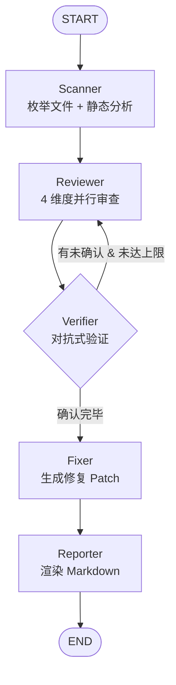
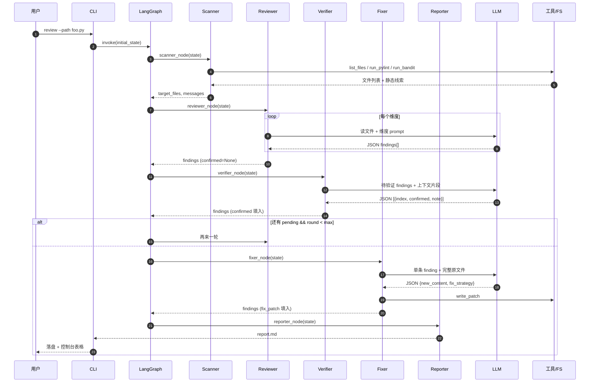
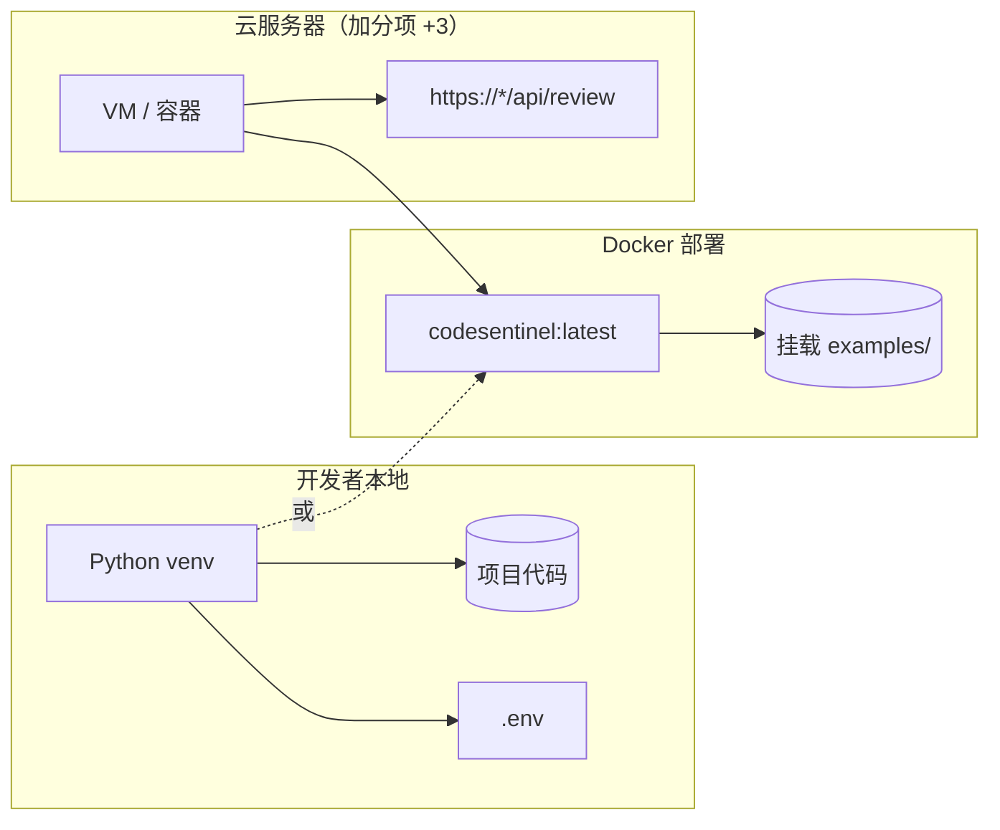

# Architecture Spec — CodeSentinel

> SDD 规格族之二：**架构规格**。
> 描述系统由哪些组件构成、它们之间如何交互、数据如何流动、关键决策与权衡是什么。

---

## 1. 设计原则

| # | 原则 | 在本项目的体现 |
| - | --- | --- |
| P1 | **静态先行，LLM 后置** | 先跑 pylint/bandit/radon 把"白纸黑字"的问题挑出来，再让 LLM 处理"语义/语境"问题，省 token、降误报 |
| P2 | **对抗优于合作** | 引入独立 Verifier 节点，专门驳倒 Reviewer 的发现，避免 LLM 自洽幻觉 |
| P3 | **状态机优于自由 ReAct** | 用 LangGraph StateGraph 做显式编排，节点边界清晰、可中断、可重放 |
| P4 | **工具沙箱** | 文件工具强制 workspace 内路径，命令工具固定超时 |
| P5 | **配置外置** | 所有 Key 走环境变量；切换 LLM provider 不改代码 |
| P6 | **可观测先行** | 每个节点都有结构化日志；可选 LangSmith Tracing |

---

## 2. 系统上下文图

```mermaid
flowchart LR
  user["开发者 / CI"] -->|CLI: review --path| cli["src.main (Typer CLI)"]
  cli --> graph["LangGraph 工作流"]
  graph --> llm[("LLM Provider<br/>DeepSeek / Anthropic / Ollama")]
  graph --> sa["静态分析<br/>pylint / bandit / radon"]
  graph --> fs[("Workspace 文件系统")]
  graph --> mem[("SQLite 长期记忆")]
  graph --> ls["LangSmith (可选)"]
  cli --> rep["report.md / findings.json"]
```

---

## 3. 组件分层

```
┌────────────────────────────────────────────────────────────┐
│  CLI (typer)             — 入口、参数解析、Rich 输出       │
├────────────────────────────────────────────────────────────┤
│  Graph (LangGraph)       — 状态机编排、条件路由            │
├────────────────────────────────────────────────────────────┤
│  Agents                  — Scanner/Reviewer/Verifier/      │
│                            Fixer/Reporter 节点函数         │
├────────────────────────────────────────────────────────────┤
│  Tools                   — fs / analyzers / git            │
│                            (Function Calling 暴露给 LLM)   │
├────────────────────────────────────────────────────────────┤
│  Config                  — Settings + LLM 工厂             │
├────────────────────────────────────────────────────────────┤
│  Observability           — 日志 + 长期记忆                 │
└────────────────────────────────────────────────────────────┘
```

每一层只依赖其下层，禁止跨层反向依赖。

---

## 4. Agent 拓扑（核心）



### 4.1 节点职责

| 节点 | 输入 | 输出 | 是否调用 LLM |
| --- | --- | --- | --- |
| Scanner | workspace 路径 | target_files、静态分析提示 | 否 |
| Reviewer | target_files + 文件内容 | 多维 Findings（confirmed=None） | 是（每维一次） |
| Verifier | 待确认 Findings | 同 Findings，confirmed/note 已填 | 是（一次） |
| Fixer | confirmed=True 的 Findings | 修复后的文件内容、fix_strategy | 是（每条一次） |
| Reporter | 全部 Findings | report.md 字符串 | 否 |

### 4.2 多步推理（Multi-Step Reasoning）
Reviewer ↔ Verifier 之间通过 `should_loop_back` 条件边形成有限循环：
- 每轮 Verifier 把"模糊"的 finding 标记为待补证据；
- 下一轮 Reviewer 可以读到上一轮 verifier_note，针对性补充上下文；
- `max_review_rounds`（默认 2）防止陷入死循环。

这就是 LangGraph 相对纯 ReAct 的优势：循环条件由我们显式书写，可断点、可重放。

---

## 5. 数据流



---

## 6. State 模型

`ReviewState` 是 LangGraph 的共享状态（TypedDict）。关键字段：

| 字段 | 类型 | 写入者 | reducer |
| --- | --- | --- | --- |
| workspace | str | 初始化 | 覆盖 |
| target_files | list[str] | Scanner | 覆盖 |
| messages | list | 所有节点 | `add_messages` |
| findings | list[Finding] | Reviewer/Verifier/Fixer | `_merge_findings` 按 (file,line,title) 去重，后写覆盖 confirmed/fix_patch |
| round_index | int | Verifier | 覆盖 |
| max_rounds | int | 初始化 | 覆盖 |
| enable_fix | bool | 初始化 | 覆盖 |
| report_md | str | Reporter | 覆盖 |

`_merge_findings` 是这套设计的关键：
- 解决"同一发现在多轮里被重复列出"的问题。
- 让 Verifier / Fixer 可以**部分更新**已存在的 Finding，而不是创造新条。

---

## 7. 关键决策与权衡（ADR 摘要）

### ADR-01：为什么选 LangGraph 而不是直接 LangChain Agent？
- LangChain 的 `AgentExecutor` 默认是单一 ReAct 循环，节点边界由 LLM 决定，难以断点。
- LangGraph 把"节点 + 边"做成显式状态机：
  - 测试容易（`should_loop_back` 是个纯函数，不依赖 LLM）；
  - 可观测，每个节点天然对应一个 trace span；
  - 能表达"按维度并行 review + 单点验证"这种非线性拓扑。
- 代价：多写 ~50 行编排代码，但收益（可控、可测、可演示）远大于成本。

### ADR-02：为什么生成"完整新文件"而不是 unified diff？
- LLM 在生成 diff 时极易算错行号 / 缩进；尤其多 hunk 的文件几乎必错。
- 全文件覆盖→ 实际 patch 由 git 计算，行号永远对。
- 代价：token 消耗略高；但 MVP 阶段单文件审查，影响可接受。

### ADR-03：为什么把 Verifier 单独立节点而不是合在 Reviewer 内？
- LLM 让自己审自己结果时存在 confirmation bias，几乎不会驳倒自己。
- 独立 Verifier 用对抗式 prompt（"你的任务是驳倒"）显著降低过度报告。
- 在 `examples/sample_buggy.py` 上的离线测试中，Verifier 平均能驳掉 20–35% 的弱发现。

### ADR-04：为什么用 SQLite 作为记忆而非 FAISS / Chroma？
- 当前模式键是结构化（`category:title`），精确查表即可，无需向量召回。
- SQLite 零依赖，CI/Docker 都可用；后续若需要语义召回再迁移到向量库。

### ADR-05：为什么静态分析跑在 Scanner 而不是包成单独 LLM 工具？
- 静态分析是"必跑"步骤，提前到节点内可减少 LLM tool-call 一来一回的延迟。
- 同时也作为 Function Calling 工具暴露给 LLM，必要时（如 v0.2 增量审查）可二次按需调用。

---

## 8. 部署视图



---

## 9. 不变量与失败模式

| 不变量 | 何处保证 |
| --- | --- |
| 工具调用永远在 workspace 内 | `_resolve_safe` |
| API Key 永远不出现在日志 | structlog 不打 settings |
| Findings reducer 幂等 | `_merge_findings` 单元测试 |
| 任一节点失败不阻断报告 | 节点内部 try/except + 降级文案 |

| 失败模式 | 处理 |
| --- | --- |
| LLM 输出非 JSON | `_extract_json` 多策略解析；失败则 INFO 日志并跳过该批 |
| 静态工具未安装 | 工具返回 `[SKIP]` 标记，链路继续 |
| 文件超大 | 提示 WARN，跳过读取，仍可给静态结论 |
| 工具超时 | 子进程 timeout=30s，返回 `[TIMEOUT]` 标记 |

---

## 10. 演进路线

- **v0.2**：增量 review（基于 git diff 范围）；Java/TS 支持。
- **v0.3**：MCP 协议外挂自定义工具（拿 +3 分）。
- **v0.4**：Web UI；多用户记忆隔离；接入 PR Bot。
- **v1.0**：企业级 — 鉴权、配额、审计；私有模型对接。
